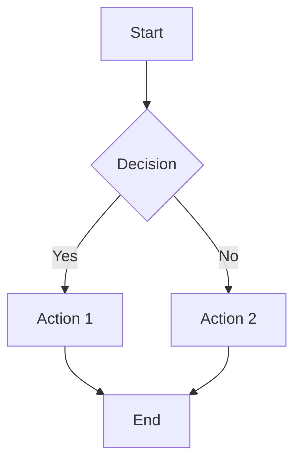

# Copilot Instructions for CloudOps Paved Roads Repository

This file provides guidance for GitHub Copilot when working within the CloudOps Paved Roads documentation repository.

## Repository Purpose

This is a documentation repository containing CloudOps best practices, operational procedures, and architectural guidance. The repository uses Markdown for all documentation and Mermaid for diagrams and visual representations.

## Documentation Format Guidelines

### Markdown Standards
- All documentation files use the `.md` extension
- Use clear, hierarchical heading structure (H1 for title, H2 for sections, etc.)
- Include a brief introduction or overview at the top of each document
- Use proper Markdown syntax for lists, code blocks, tables, and emphasis
- Maintain consistent formatting across all documents
- Include "Last updated" timestamp at the end of documents

### Code Examples
- Include language specification in code fences (e.g., ```python, ```bash, ```yaml)
- Provide context and explanation for each code example
- Highlight key lines with comments when necessary
- Include realistic, runnable examples where possible

### Links and References
- Use relative links between documentation files: `[Link Text](path/to/file.md)`
- Link related documentation to improve navigation
- Provide context for external links with brief descriptions

## Mermaid Diagrams

### When to Use Mermaid
- Architecture diagrams and system designs
- Process flows and workflows
- Organizational hierarchies
- Network topologies
- Timeline and Gantt charts
- Sequence diagrams for interactions
- State diagrams for system states

### Mermaid Syntax Standards
- Use semantic diagram types for clarity
- Keep diagrams clean and readable
- Add titles to all diagrams using `---` syntax
- Use descriptive labels for all nodes and connections
- Use appropriate styling to highlight important elements
- Prefer simple node labels (no HTML, no braces `{}`, minimize parentheses) to satisfy GitHub's Mermaid parser
- Avoid line breaks in labels; keep them single-line to prevent parse errors
- If styling, set font size via init block (e.g., `%%{init: {'themeVariables': { 'fontSize': '12px' }}}%%`)
- Use `subgraph` to group related resources (e.g., workloads account, ECS cluster)
- Keep edges simple; avoid special characters in edge labels
- When using bright fills, set `color:#000` (dark text) for readability

### Example Mermaid Implementation
```markdown

```

## Content Guidelines

### Writing Style
- Use clear, professional language
- Write for an audience of CloudOps professionals
- Be concise but comprehensive
- Use active voice
- Explain technical concepts clearly

### Document Structure
1. **Title** (H1) - Clear, descriptive title
2. **Overview/Introduction** - Brief summary of content
3. **Sections** (H2, H3) - Logical organization of content
4. **Examples** - Real-world use cases and implementations
5. **Related Documentation** - Links to related topics
6. **Metadata** - Last updated date

### Best Practices
- Keep documents focused on a single topic
- Use consistent terminology throughout
- Include troubleshooting sections where applicable
- Provide step-by-step instructions for procedures
- Include prerequisites and requirements
- Document assumptions and constraints

## File Organization

### Directory Structure
Organize documents logically by domain or topic area:
```
/
├── README.md
├── .copilot-instructions.md
├── architecture/
│   ├── overview.md
│   └── patterns/
├── operations/
│   ├── procedures.md
│   └── runbooks/
├── guides/
│   └── best-practices.md
└── reference/
    └── glossary.md
```

### Naming Conventions
- Use lowercase filenames with hyphens for spaces (e.g., `database-backup-procedures.md`)
- Use descriptive names that indicate content
- Create topic subdirectories for related documents

## Git Workflow

### Commit Messages
- Use descriptive commit messages
- Reference the document or section affected
- Example: `docs: add disaster recovery procedures`

### Content Changes
- Commit documentation changes regularly
- Use meaningful commit messages
- Update metadata (last updated dates) when modifying documents

### Commit Workflow
- **All changes must be committed to the local repository upon completion**
- Do not leave work uncommitted
- Each logical change or document addition should result in a meaningful commit
- Use `git status` to verify all changes are staged before committing
- Ensure commit messages clearly describe what was added or modified

## Enhancement Considerations

### When to Suggest Alternative Formats
- If Mermaid becomes insufficient for complex visualizations, suggest alternatives (SVG, PNG diagrams)
- For interactive content, suggest appropriate solutions
- Document the rationale for format choices

### Future Improvements
- Monitor for new Mermaid features that might enhance diagrams
- Suggest reorganization if document structure becomes unwieldy
- Recommend links between related content

## Key Principles

1. **Clarity First**: Ensure all documentation is clear and accessible
2. **Consistency**: Maintain consistent formatting and style across all documents
3. **Maintainability**: Use version-controllable formats (Markdown + Mermaid)
4. **Completeness**: Provide sufficient detail for readers to understand and act on content
5. **Currency**: Keep documentation up-to-date with actual practices

---

*These instructions guide Copilot's behavior when working with the CloudOps Paved Roads repository.*
