# AWS ECS Application Deployment with CodePipeline

## Problem Statement

Teams need a standardized, repeatable way to deploy containerized applications to AWS with automated CI/CD pipelines, proper environment separation, load balancing, and CDN/WAF protection for external-facing services.

## Solution Overview

This paved road provides a complete deployment pipeline for containerized applications running on AWS ECS Fargate. The solution leverages AWS CodePipeline and CodeBuild for CI/CD, separates deployment infrastructure by environment, and integrates with Cloudflare for external-facing applications to provide caching and WAF capabilities.

### Key Components

- **Source Control**: GitHub repository with application code
- **Build Pipeline**: AWS CodePipeline and CodeBuild (per environment)
- **Container Registry**: Amazon ECR (in workloads account)
- **Compute**: ECS Fargate (in workloads account)
- **Load Balancing**: Application Load Balancer with SSL termination
- **CDN/WAF**: Cloudflare (for external applications)

## Architecture Diagram

```mermaid
%%{init: {'themeVariables': { 'fontSize': '12px' }}}%%
graph LR
   Dev[Developer] -->|git push| GH[GitHub repo with Dockerfile and buildspec]
   GH -->|env branch commit| CP[CodePipeline and CodeBuild deployments env account]

   CP --> ECR

   subgraph workloads_env_account [Workloads env account]
      ECR[ECR repo]
      ECR --> ECS[ECS cluster Fargate]
      ECS --> SVC[ECS service ARM64 tasks]
   end

   SVC --> TG[Target group]
   TG --> ALB[ALB SSL termination]
   ALB --> CF[Cloudflare CDN + WAF]
   CF --> User[End users]

   style GH fill:#f3c2f3,stroke:#333,stroke-width:2px,color:#000
   style CP fill:#ffdfba,stroke:#333,stroke-width:2px,color:#000
   style ECR fill:#ffeb99,stroke:#333,stroke-width:2px,color:#000
   style ECS fill:#c3f7c3,stroke:#333,stroke-width:2px,color:#000
   style SVC fill:#c3f7c3,stroke:#333,stroke-width:2px,color:#000
   style ALB fill:#f9c0c0,stroke:#333,stroke-width:2px,color:#000
   style CF fill:#c0c9ff,stroke:#333,stroke-width:2px,color:#000
```



## Requirements

### Prerequisites

- **GitHub Repository**: Application code with required files
  - `Dockerfile` - Container build instructions
  - `buildspec.yml` - CodeBuild build specification
- **AWS Accounts**: 
  - Deployment accounts: `deployments-dev`, `deployments-test`, `deployments-stage`, `deployments-prod`
  - Workloads account (determined by CloudOps/DevOps based on application requirements)
- **Cloudflare Account**: For external-facing applications
- **Domain Name**: Registered and managed in Cloudflare (if external)

### Repository Structure

```
app-repository/
├── Dockerfile
├── buildspec.yml
├── src/
│   └── (application code)
└── README.md
```

### Branch Strategy

- `dev` branch → triggers deployment to dev environment
- `test` branch → triggers deployment to test environment  
- `stage` branch → triggers deployment to stage environment
- `main` or `prod` branch → triggers deployment to prod environment

## Implementation Guide

### Step 1: Prepare GitHub Repository

1. Ensure repository contains `Dockerfile` and `buildspec.yml`
2. Configure branch protection rules for environment branches
3. Set up appropriate branching strategy (dev/test/stage/prod)
4. Review sample files in the [samples directory](samples/)

### Step 2: Infrastructure Provisioning

CloudOps will provision all AWS infrastructure using standard Terraform modules and templates, including:

**Per Environment (in deployments-{env} accounts):**
- CodePipeline pipeline configured for the appropriate branch
- CodeBuild project with ECR push permissions

**In Workloads Account:**
- ECR repository with image scanning and lifecycle policies
- ECS Cluster with Fargate capacity provider
- ECS Task Definition (ARM64 architecture by default)
- ECS Service with sensible defaults
- Application Load Balancer with target group and SSL configuration
- Cloudflare DNS and WAF configuration (for external applications)

**Note**: Contact CloudOps team to initiate infrastructure provisioning for your application.

## Configuration

### URL Pattern

Applications follow the URL pattern:

**Non-Production Environments:**
```
{environment}-{app-name}.{domain}.{com|io}
```

Examples:
- `dev-api.example.com`
- `test-webapp.company.io`
- `stage-service.example.com`

**Production Environment:**
```
{app-name}.{domain}.{com|io}
```

Examples:
- `api.example.com`
- `webapp.company.io`
- `service.example.com`

### Environment Variables

Set in ECS Task Definition:
- `ENVIRONMENT` - dev/test/stage/prod
- `AWS_REGION` - AWS region
- Application-specific variables

### Sensible Defaults

**ECS Service:**
- Minimum healthy percent: 100%
- Maximum percent: 200%
- Health check grace period: 60 seconds
- Deployment circuit breaker: Enabled

**Task Definition:**
- CPU: 256 (0.25 vCPU) - adjust based on needs
- Memory: 512 MB - adjust based on needs
- Architecture: ARM64 (use AMD64 if incompatible)

**ALB:**
- Idle timeout: 60 seconds
- Deletion protection: Enabled (for prod)
- Access logs: Enabled to S3

**Target Group:**
- Protocol: HTTP/HTTPS
- Health check interval: 30 seconds
- Healthy threshold: 2
- Unhealthy threshold: 3
- Timeout: 5 seconds

## Operations

### Deployment Process

1. Developer commits code to environment branch (e.g., `dev`)
2. GitHub webhook triggers CodePipeline in corresponding deployment account
3. CodeBuild executes `buildspec.yml`:
   - Builds Docker image
   - Tags image with commit SHA and environment
   - Pushes to ECR in workloads account
4. CodePipeline triggers ECS service update
5. ECS performs rolling deployment:
   - Launches new tasks with updated image
   - Waits for health checks to pass
   - Drains and stops old tasks
6. New version is live

### Monitoring

- **ECS Service**: CloudWatch metrics (CPU, memory, task count)
- **ALB**: Target health, request count, response times
- **CodePipeline**: Build success/failure notifications
- **Cloudflare**: Analytics dashboard for traffic and threats

### Scaling

**Manual Scaling:**
- Update ECS service desired count

**Auto Scaling (recommended for prod):**
- Target tracking: CPU/memory utilization
- Step scaling: Based on CloudWatch alarms
- Scheduled scaling: For predictable traffic patterns

### SSL Certificate Management

- ACM certificates auto-renew
- Cloudflare certificates auto-renew
- Monitor certificate expiration via CloudWatch

## Troubleshooting

### Build Failures

**Symptom**: CodeBuild fails during image build

**Common Causes**:
- Invalid Dockerfile syntax
- Missing dependencies in buildspec.yml
- ECR push permission issues

**Resolution**:
1. Check CodeBuild logs in CloudWatch
2. Verify IAM permissions for CodeBuild role
3. Test Dockerfile locally
4. Validate buildspec.yml syntax

### Deployment Failures

**Symptom**: ECS service fails to stabilize

**Common Causes**:
- Task fails health checks
- Insufficient resources (CPU/memory)
- Container crashes on startup
- Image pull errors

**Resolution**:
1. Check ECS task logs in CloudWatch
2. Verify task definition resource allocations
3. Review application startup logs
4. Confirm ECR repository permissions
5. Check ALB target group health status

### Connection Issues

**Symptom**: Users cannot reach application

**Common Causes**:
- Cloudflare proxy issues
- DNS misconfiguration
- ALB security group restrictions
- Target group health check failures

**Resolution**:
1. Verify Cloudflare DNS settings (orange cloud enabled)
2. Check ALB security groups allow traffic from Cloudflare IPs
3. Confirm target group shows healthy targets
4. Review ALB access logs
5. Test direct ALB endpoint (bypass Cloudflare)

### Architecture Compatibility

**Symptom**: Application won't run on ARM64

**Resolution**:
1. Update task definition to use AMD64 architecture
2. Rebuild container image for AMD64 platform
3. Update buildspec.yml if multi-arch builds needed:
   ```yaml
   docker buildx build --platform linux/amd64 -t ...
   ```

## References

### Related Documentation
- [AWS ECS Best Practices](https://docs.aws.amazon.com/AmazonECS/latest/bestpracticesguide/)
- [AWS CodePipeline Documentation](https://docs.aws.amazon.com/codepipeline/)
- [Cloudflare SSL/TLS Documentation](https://developers.cloudflare.com/ssl/)

### Internal Resources
- CloudOps team contacts for workloads account assignment
- DevOps team for pipeline troubleshooting
- Security team for WAF rule customization

### Sample Files

Reference sample files for a basic Python application:

- [buildspec.yml](samples/buildspec.yml) - CodeBuild build specification
- [Dockerfile](samples/Dockerfile) - Container image build instructions

**Note**: These are basic examples and should be customized for your specific application requirements.

---

*Last updated: January 2026*
