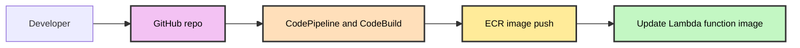

# Containerized Lambda Application Deployment

## Problem Statement

Teams need a standardized, repeatable way to deploy containerized serverless applications to AWS Lambda using CI/CD, environment separation, and proper edge protection for external-facing endpoints.

## Solution Overview

This paved road delivers a CI/CD pipeline that builds a container image, pushes it to ECR in a workloads env account, and deploys it to an AWS Lambda function. For externally-facing endpoints, traffic is fronted by Cloudflare (CDN/WAF) and delivered through an ALB with SSL termination before invoking the Lambda function. CI/CD runs in environment-specific deployments accounts.

## Key Components

- **Source Control**: GitHub repository
- **Build Pipeline**: CodePipeline and CodeBuild (deployments env account)
- **Container Registry**: ECR (workloads env account)
- **Compute**: AWS Lambda function using container image
- **Edge and Routing**: Cloudflare (CDN/WAF), ALB (HTTPS) with target group that invokes Lambda

## Deployment Flow



## Runtime Architecture

```mermaid
%%{init: {'themeVariables': { 'fontSize': '12px' }}}%%
graph TD
    subgraph Cloudflare
        CF[CDN and WAF]
    end

    subgraph Workloads env account
        ALB[ALB with HTTPS]
        TG[Target group]
        LFN[Lambda function (container image)]
        ECR[ECR image repo]
    end

    CF --> ALB
    ALB --> TG
    TG --> LFN
    ECR -.-> LFN

    style CF fill:#c0c9ff,stroke:#333,stroke-width:2px,color:#000
    style ALB fill:#f9c0c0,stroke:#333,stroke-width:2px,color:#000
    style TG fill:#f9c0c0,stroke:#333,stroke-width:2px,color:#000
    style LFN fill:#c3f7c3,stroke:#333,stroke-width:2px,color:#000
    style ECR fill:#ffeb99,stroke:#333,stroke-width:2px,color:#000
```

## Requirements

### Prerequisites

- **GitHub repository** containing application source, `Dockerfile`, and `buildspec.yml`
- **AWS accounts**:
  - Deployments env accounts: dev/test/stage/prod (CodePipeline/CodeBuild)
  - Workloads env account: ECR and Lambda function
- **Cloudflare** account for CDN/WAF in front of ALB (external apps)
- **Domain** managed via Cloudflare

### Branch Strategy

- `dev` → deploys to dev
- `test` → deploys to test
- `stage` → deploys to stage
- `main` or `prod` → deploys to prod

## Implementation Guide

### Step 1: Prepare GitHub Repository

1. Include a `Dockerfile` for the Lambda container image
2. Include a `buildspec.yml` that builds, tags, and pushes the image to ECR, then updates the Lambda function image
3. Protect environment branches and configure CI triggers

### Step 2: Infrastructure Provisioning

CloudOps provisions all infrastructure using standard Terraform modules and templates:

- Deployments env account: CodePipeline + CodeBuild
- Workloads env account: ECR repository and Lambda function
- Cloudflare and ALB: External traffic flows CF → ALB → Lambda (if externally exposed)

## Configuration

### URL Pattern

- **Non-production**: `{environment}-{app-name}.{domain}.{com|io}`
- **Production**: `{app-name}.{domain}.{com|io}`

### SSL/TLS

- SSL termination at Cloudflare
- SSL termination at ALB (HTTPS)

### Sensible Defaults

- **Lambda architecture**: ARM64 preferred unless incompatible
- **Memory/timeout**: Set per app needs; start with 512–1024 MB and 30 seconds
- **Concurrency**: Configure reserved concurrency if needed

## Sample Files

### Sample `Dockerfile` (Python)

```Dockerfile
# AWS Lambda Python 3.11 base (ARM64)
FROM public.ecr.aws/lambda/python:3.11-arm64

# Copy app and dependencies
COPY requirements.txt ./
RUN pip install --no-cache-dir -r requirements.txt -t /var/task
COPY app.py /var/task/

# Set the handler (module.function)
CMD ["app.handler"]
```

### Sample `app.py`

```python
def handler(event, context):
    return {
        "statusCode": 200,
        "headers": {"Content-Type": "application/json"},
        "body": "{\"message\": \"hello from lambda\"}"
    }
```

### Sample `buildspec.yml`

Builds image, pushes to ECR, and updates Lambda function to point at the new image tag.

```yaml
version: 0.2

env:
  variables:
    AWS_REGION: us-east-1
    ECR_REGISTRY: 123456789012.dkr.ecr.us-east-1.amazonaws.com
    ECR_REPOSITORY: my-lambda-repo
    FUNCTION_NAME: my-lambda-func

phases:
  pre_build:
    commands:
      - echo Logging in to ECR
      - aws ecr get-login-password --region $AWS_REGION | docker login --username AWS --password-stdin $ECR_REGISTRY
      - COMMIT_HASH=$(echo $CODEBUILD_RESOLVED_SOURCE_VERSION | cut -c 1-7)
      - IMAGE_TAG=${COMMIT_HASH:=latest}
  build:
    commands:
      - echo Building image
      - docker build -t $ECR_REPOSITORY:$IMAGE_TAG .
      - docker tag $ECR_REPOSITORY:$IMAGE_TAG $ECR_REGISTRY/$ECR_REPOSITORY:$IMAGE_TAG
      - docker tag $ECR_REPOSITORY:$IMAGE_TAG $ECR_REGISTRY/$ECR_REPOSITORY:$ENVIRONMENT
  post_build:
    commands:
      - echo Pushing image
      - docker push $ECR_REGISTRY/$ECR_REPOSITORY:$IMAGE_TAG
      - docker push $ECR_REGISTRY/$ECR_REPOSITORY:$ENVIRONMENT
      - echo Updating Lambda function to new image
      - aws lambda update-function-code --function-name $FUNCTION_NAME --image-uri $ECR_REGISTRY/$ECR_REPOSITORY:$IMAGE_TAG --region $AWS_REGION

artifacts:
  files:
    - '**/*'
```

## Operations

- On env branch commits, CodePipeline triggers CodeBuild to build and push image
- Lambda function is updated to use the new image
- For external endpoints, Cloudflare provides caching and WAF; SSL terminates at Cloudflare and ALB

## Troubleshooting

- **Image update fails**: Verify IAM permissions for CodeBuild role and Lambda update
- **Cold start latency**: Tune memory/timeout and consider provisioned concurrency
- **Edge path issues**: Confirm ALB routes to Lambda target group and Cloudflare DNS/WAF settings

---

*Last updated: January 2026*
