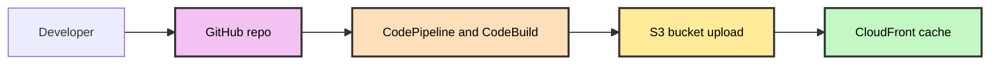

# S3 CDN Application Hosting

## Problem Statement

Teams need a standardized way to publish static apps and assets to S3 with proper CDN/WAF protection, environment separation, and secure access paths that prevent bypassing edge protections.

## Solution Overview

This paved road describes deploying static applications/assets to an S3 bucket in a workloads account, distributed via CloudFront, and fronted by Cloudflare for global CDN and WAF. CI/CD runs in an environment-specific deployments account using CodePipeline and CodeBuild. S3 buckets have versioning and encryption enabled by default. SSL terminates at Cloudflare and at CloudFront.

## Key Components

- **Source Control**: GitHub repository for the application or assets
- **Build Pipeline**: CodePipeline + CodeBuild in deployments env account
- **Storage**: S3 bucket in workloads env account (versioning + encryption on)
- **CDN**: CloudFront distribution in workloads env account
- **Edge Protection**: Cloudflare (CDN/WAF) in front of CloudFront

## Deployment Flow



## Runtime Architecture

```mermaid
%%{init: {'themeVariables': { 'fontSize': '12px' }}}%%
graph TD
    subgraph Cloudflare
        CF[CDN and WAF]
    end

    subgraph Workloads env account
        S3B[S3 bucket (versioning + encryption)]
        CFN[CloudFront distribution]
    end

    CF --> CFN
    CFN --> S3B

    style CF fill:#c0c9ff,stroke:#333,stroke-width:2px,color:#000
    style S3B fill:#ffeb99,stroke:#333,stroke-width:2px,color:#000
    style CFN fill:#c3f7c3,stroke:#333,stroke-width:2px,color:#000
```

## Requirements

### Prerequisites

- **GitHub repository** with application or asset source and a `buildspec.yml` that publishes to S3
- **AWS accounts**:
  - Deployments env accounts: dev/test/stage/prod
  - Workloads env account: hosts S3 bucket and CloudFront
- **Cloudflare** account for CDN/WAF in front of CloudFront
- **Domain**: managed via Cloudflare

### Branch Strategy

- `dev` branch → deploys to dev env
- `test` branch → deploys to test env
- `stage` branch → deploys to stage env
- `main` or `prod` branch → deploys to prod env

## Implementation Guide

### Step 1: Prepare GitHub Repository

1. Include a `buildspec.yml` that builds and publishes the site/assets to S3
2. Set branch protection rules for environment branches
3. Ensure environment-specific configuration (e.g., bucket name) is provided via build-time environment variables or parameter store

### Step 2: Infrastructure Provisioning

CloudOps provisions all infrastructure using standard Terraform modules and templates:

- Deployments env account: CodePipeline + CodeBuild
- Workloads env account: S3 bucket (versioning + encryption), CloudFront distribution
- Cloudflare: DNS and WAF in front of CloudFront

Note: CloudFront is configured to expect a header from Cloudflare. Requests missing the expected header are denied to prevent bypassing the Cloudflare layer.

## Configuration

### Security and Access Controls

- **S3 bucket**: Versioning enabled; encryption enabled (SSE-KMS or SSE-S3 per policy)
- **CloudFront**: Origin access control and rule requiring a custom header provided by Cloudflare
- **Cloudflare**: WAF enabled; caching on by default unless otherwise requested

### URL Pattern

- **Non-production**: `{environment}-{app-name}.{domain}.{com|io}`
- **Production**: `{app-name}.{domain}.{com|io}`

### SSL/TLS

- SSL termination at Cloudflare edge
- SSL termination at CloudFront (viewer SSL)

## Sample Files

### Sample `buildspec.yml`

Publishes build output folder (e.g., `dist/`) to S3 and invalidates CloudFront cache.

```yaml
version: 0.2

env:
  variables:
    AWS_REGION: us-east-1
    S3_BUCKET: my-app-env-bucket
    CLOUDFRONT_DIST_ID: E1234567890
    BUILD_DIR: dist

phases:
  install:
    commands:
      - echo Installing dependencies
  build:
    commands:
      - echo Building site
      - mkdir -p $BUILD_DIR && echo "hello" > $BUILD_DIR/index.html
  post_build:
    commands:
      - echo Syncing to S3
      - aws s3 sync $BUILD_DIR s3://$S3_BUCKET/ --delete
      - echo Creating CloudFront invalidation
      - aws cloudfront create-invalidation --distribution-id $CLOUDFRONT_DIST_ID --paths "/*"

artifacts:
  files:
    - '**/*'
  base-directory: $BUILD_DIR
```

## Operations

- CodeBuild publishes to S3 on environment branch commits
- CloudFront cache invalidated post-deploy to serve updated content
- Cloudflare provides caching and WAF; caching is assumed unless requested otherwise

## Troubleshooting

- **Access bypass**: Ensure CloudFront rule requires the Cloudflare header; verify Cloudflare sends it
- **Stale content**: Confirm CloudFront invalidations succeed; check cache-control headers
- **Missing files**: Confirm `aws s3 sync` paths and that artifacts are built into the expected folder

---

*Last updated: January 2026*
